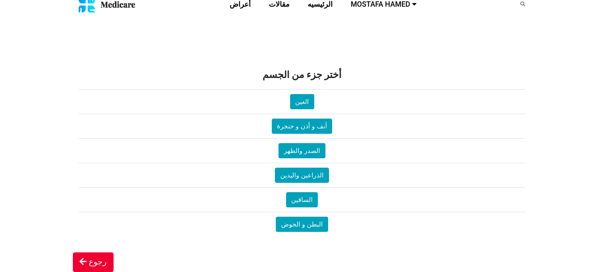

# symptomp
it's an arabic symptomp checker website made with laravel and mysql




# installation dependencies


after download the project:

```

cd/ symptomp

composer install

composer update

npm install

php artisan key:generate
```

```
copy .env.example file and name it .env only

 make database credentials in .env file:

DB_DATABASE=symptom

DB_USERNAME=root

DB_PASSWORD=
 ```
```
 run "php artisan serve
```

/***********/
